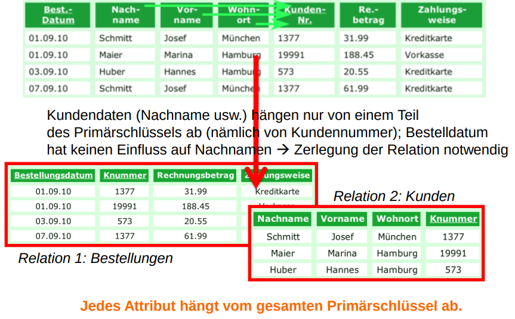
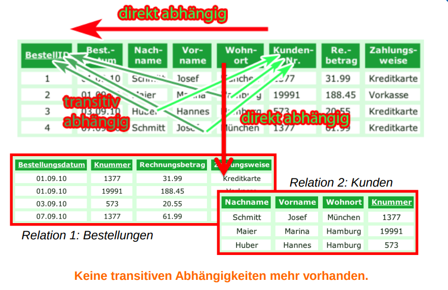

# Normalisierung (Dataenbanken)

- [Normalisierung (Dataenbanken)](#normalisierung-dataenbanken)
  - [Allgemein](#allgemein)
  - [Normalform (1NF)](#normalform-1nf)
  - [Normalform (2NF)](#normalform-2nf)
  - [Normalform (3NF)](#normalform-3nf)

## Allgemein
Bei der Normalisierung von Datenbanken bzw. Tabellen handelt es sich um einen Prozess der Strukturierung, um Redundanzen zu vermeiden und die Datenintegrität zu sichern. Ziel ist es, die Daten in eine Form zu bringen, die möglichst effizient gespeichert und verarbeitet werden kann.

Dabei werden Tabellen schrittweise in sogenannte Normalformen überführt, wobei jede Normalform bestimmte Anforderungen erfüllt. Typischerweise durchläuft man die ersten drei Normalformen (**1NF**, **2NF**, **3NF**).

**Die wichtigsten Ziele der Normalisierung sind:**

Vermeidung von Redundanzen (doppelt gespeicherte Informationen),

Vermeidung von Anomalien beim Einfügen, Ändern oder Löschen von Daten,

Verbesserung der Datenkonsistenz,

Erleichterung der Pflege und Erweiterung der Datenbankstruktur.

## Normalform (1NF)
Eine Tabelle befindet sich in der ersten Normalform, wenn alle Informationen in ihren Feldern atomar, also nicht weiter zerlegbar, sind. Jede Zelle darf nur einen einzigen Wert enthalten.

> **Regel:**\
> Eine Tabelle befindet sich in der 1. Normalform, wenn alle Attribute atomar sind, also nur einen einzigen Wert pro Zelle enthalten.

**🔍 Typische Verstöße:**
- mehrere Telefonnummern in einem Feld
- Kommalisten oder verschachtelte Werte

## Normalform (2NF)
Die zweite Normalform setzt voraus, dass die Tabelle bereits in der 1NF ist und dass alle Informationen vollständig vom gesamten Primärschlüssel abhängen. Wenn der Primärschlüssel aus mehreren Spalten besteht, darf kein Feld nur von einem Teil des Schlüssels abhängen.

> **Regel:**\
> Eine Tabelle befindet sich in der 1. Normalform, wenn alle Attribute atomar sind, also nur einen einzigen Wert pro Zelle enthalten.

**🔍 Typische Verstöße:**

- mehrere Telefonnummern in einem Feld
- Kommalisten oder verschachtelte Werte

## Normalform (3NF)
Die dritte Normalform baut auf der 2NF auf, stellt aber zusätzlich sicher, dass kein Feld indirekt vom Primärschlüssel abhängig ist, also über ein anderes Nicht-Schlüsselattribut.

> **Regel:**\
> Die Tabelle ist in der 3. Normalform, wenn sie:\
> – bereits in der 2NF ist und\
> – kein Nicht-Schlüsselattribut transitiv vom Primärschlüssel abhängig ist.

