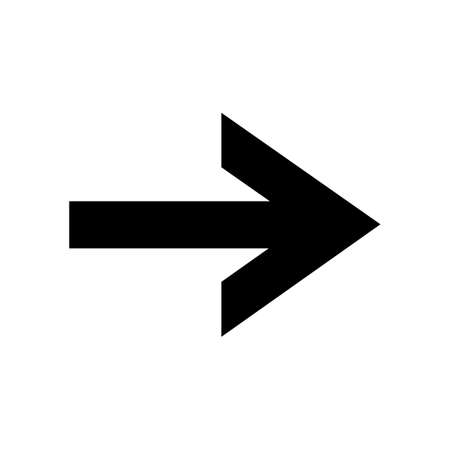

# Hypertext Markup Language (HTML)

- [Hypertext Markup Language (HTML)](#hypertext-markup-language-html)
  - [1. Was ist HTML?](#1-was-ist-html)
    - [1.1 Beispiel](#11-beispiel)
  - [1.2 HTML-Dokumente](#12-html-dokumente)
    - [1.2.1 Document Object Model](#121-document-object-model)
  - [1.3 HTML-Elemente](#13-html-elemente)
    - [1.3.1 Attribute](#131-attribute)
      - [1.3.1.1 Klassen](#1311-klassen)
      - [1.3.1.2 IDs](#1312-ids)
    - [1.3.2 HTML Kommentare](#132-html-kommentare)
  - [1.4 Grundlegende HTML-Elemente](#14-grundlegende-html-elemente)
    - [1.4.1 Überschriften](#141-überschriften)
    - [1.4.2 Paragraphen](#142-paragraphen)
    - [1.4.3 Grafiken einbinden](#143-grafiken-einbinden)
    - [1.4.4 Links](#144-links)
    - [1.4.5 Fett und kursiv](#145-fett-und-kursiv)
    - [1.4.6 Listen](#146-listen)
    - [1.4.7 Container / Bereiche](#147-container--bereiche)
  - [1.5 Tabellen](#15-tabellen)
    - [1.5.1 Mehrere Zellen miteinander verbinden](#151-mehrere-zellen-miteinander-verbinden)
  - [1.6 Eingabefelder](#16-eingabefelder)
    - [1.6.1 Grundlegende Elemente](#161-grundlegende-elemente)
      - [1.6.1.1 Textfeld](#1611-textfeld)
      - [1.6.1.2 Textfeld mit Beschriftung (Label)](#1612-textfeld-mit-beschriftung-label)
      - [1.6.1.3 Textfeld mit Ausfüllhilfe (Placeholder)](#1613-textfeld-mit-ausfüllhilfe-placeholder)
      - [1.6.1.4 Textfeld vorausgefüllt (Value)](#1614-textfeld-vorausgefüllt-value)
      - [1.6.1.5 Textfeld für Passwörter](#1615-textfeld-für-passwörter)
      - [1.6.1.6 Checkbox](#1616-checkbox)
      - [1.6.1.7 Radio Buttons](#1617-radio-buttons)
      - [1.6.1.8 Dropdown Menus](#1618-dropdown-menus)
      - [1.6.1.9 mehrzeilige Textfelder (Textarea)](#1619-mehrzeilige-textfelder-textarea)
      - [1.6.1.10 Buttons](#16110-buttons)
    - [1.6.2 Formulare](#162-formulare)


## 1. Was ist HTML?
HTML steht für **Hypertext Markup Language**

- HTML beschreibt die Struktur einer Webseite
- HTML besteht aus Elementen
- HTML wird in Dateien mit der Endung .html gespeichert
- HTML-Dateien werden auf einem Server gespeichert, auf Anfrage zum Browser übertragen und
von diesem angezeigt.

### 1.1 Beispiel
```Html
<!DOCTYPE html>
<html>
<head>
    <title>Seitentitel</title>
</head>
<body>
    <h1>Dies ist eine Überschrift</h1>
    <p>Dies ist ein Textblock.</p>
</body>
</html>
```

## 1.2 HTML-Dokumente
Jedes HTML-Dokument beginnt mit der Zeile:
```html
<!DOCTYPE html>
```  
und besitzt folgende Grundstruktur:
```html
<!DOCTYPE html>
<html lang="de">
<head>
    <meta charset="utf-8">
    <title>Seitentitel</title>
</head>
<body>
    <!-- Hier steht der im Browserfenster angezeigte Inhalt -->
</body>
</html>
```
- Das head-Element enthält Metadaten wie Titel und weitere Einstellungen und Verweise auf weitere
Resourcen (Styles, Skripte, Schriftarten, …)
- Das body-Element enthält den Inhalt, der im Browserfenster angezeigt wird.

### 1.2.1 Document Object Model
HTML-Code ist hierarchisch aufgebaut, da die Elemente ineinander verschachtelt sind.
Der Browser erzeugt aus dem HTML-Code eine Baumstruktur, das sogenannte Document Object Model
(DOM). Das DOM enthält Elementknoten, Attributknoten und Textknoten.

## 1.3 HTML-Elemente
Ein HTML-Element besteht aus einem öffnenden Tag, einem Inhalt und einem schließenden Tag:
```html
<tagname>Inhalt</tagname>
```

Das gesamte nennt sich Element.\
Der Name des Elements ist der Tagname.

Es gibt Ausnahmen: 
Manche Elemente bestehen nur aus einem einzelnen Tagnamen ohne Inhalt und schließendes Tag:
```html
 <br>
```
Elemente können ineinander verschachtelt sein, das innere Element muss aber vor dem äußeren
geschlossen werden.

### 1.3.1 Attribute
- HTML-Attribute beschreiben zusätzliche Eigenschaften von HTML-Elementen.
- Attribute werden immer im öffnenden Tag angegeben.
- Attribute sind typischerweise Name/Werte-Paare: name="wert"
  
Beispiel:
```html
<a href="https://google.com/">Zur Seite google.com</a>
```
Das Element a hat hier ein Attribut mit dem Namen href und dem Wert „https://google.com/“.

#### 1.3.1.1 Klassen
Klassen sind nicht zu verwechseln mit Klassen aus der objektorientierte Programmierung. Sie dienen in
HTML zur zusätzlichen Identifikation von Elementen, um mehrere gleichnamige Elemente
auseinanderhalten zu können. Dies ist wichtig, wenn man von CSS oder JavaScript darauf verweisen
möchte.
HTML:
```html
<div class="menu">...</div>
```
CSS:
```css
.menu { background-color: grey; }
```
JavaScript:
```javascript
let menu = document.querySelector(".menu");
```

#### 1.3.1.2 IDs
Anstatt Klassen können zur Identifikation von Elementen auch IDs verwendet werden. IDs dürfen pro
HTML-Dokument jedoch nur einmal vorkommen. Besteht keine Notwendigkeit zur Verwendung von IDs,
sollte man Klassen verwenden.
HTML:
```html
<div id="menu">...</div>
```
CSS:
```css
#menu { background-color: grey; }
```
JavaScript:
```javascript
let menu = document.querySelector("#menu");
```

### 1.3.2 HTML Kommentare
HTML Kommentare werden im Browser nicht angezeigt, aber können eine Hilfe bei der Dokumentation des
Codes sein.
```html
 <!-- Das ist ein Kommentar -->
```

## 1.4 Grundlegende HTML-Elemente
- **h1-h6:** Überschriften
- **p:** Paragraf / Absatz
- **br:** neue Zeile im Paragraf
- **img:** Grafik
- **a:** Link
- **b, i**
- **ul, ol, li:** Listen / Aufzählungen
- **div:** Block-Container
- **span:** Inline-Container

### 1.4.1 Überschriften
```html
<h1>Dies ist die größte Überschrift</h1>
…
</h6>Dies ist die kleinste Überschrift</h6>
```
> <h1>Dies ist die größte Überschrift</h1>
> …<br>
> </h6>Dies ist die kleinste Überschrift</h6>

### 1.4.2 Paragraphen
```html
<p>
    Dies ist ein Textabschnitt mit Zeilenumbruch.<br>
    Dies ist die zweite Zeile.
</p>
```
> <p>
>     Dies ist ein Textabschnitt mit Zeilenumbruch.<br>
>     Dies ist die zweite Zeile.
> </p>

### 1.4.3 Grafiken einbinden
```html

```
> 

Attribute:
- **src:** Der Dateiname der Grafik. Auch Pfade sind erlaubt: src="../bilder/pfeil.png"
- **alt:** Ein Alternativtext, falls die Grafik nicht angezeigt werden kann oder für Bildschirmleser
- **title:** Ein Text der angezeigt wird, wenn man mit der Maus das Bild berührt.
- **width:** Die Breite der Grafik.
- **height:** Die Höhe der Grafik.

### 1.4.4 Links
Weiterleitung auf andere Seiten:
```html
<a href="https://google.com">
    Besuche Google
</a>
```
> <a href="https://google.com">
>     Besuche Google
> </a>


Weiterleitung auf Inhalte der gleichen Seite, z.B. an den Seitenanfang, der z.B. durch die id „wrapper“
gekennzeichnet ist.

```html
<a href="#wrapper">
 nach oben
</a>
```
> <a href="#wrapper">
>  nach oben
> </a>

### 1.4.5 Fett und kursiv
```html
<b>Ich bin fett gedruckt.</b>
<i>Und ich bin kursiv gedruckt.</i>
```
> <b>Ich bin fett gedruckt.</b>\
> <i>Und ich bin kursiv gedruckt.</i>

### 1.4.6 Listen
**ungeordnete Liste** (ohne Nummerierung):
```html
<ul>
    <li>2 Eier</li>
    <li>200 ml Milch</li>
    <li>1 Prise Zucker</li>
    <li>1 Prise Salz</li>
    <li>200 g Mehl</li>
    <li>60 ml Mineralwasser</li>
</ul>
```
> <ul>
>     <li>2 Eier</li>
>     <li>200 ml Milch</li>
>     <li>1 Prise Zucker</li>
>     <li>1 Prise Salz</li>
>     <li>200 g Mehl</li>
>     <li>60 ml Mineralwasser</li>
> </ul>

**geordnete Liste** mit Nummerierung (1., 2., 3., ...):

```html
<ol>
    <li>Zutaten zu einem glatten Teig rühren.</li>
    <li>Eine Pfanne mit etwas Speiseöl erhitzen.</li>
    <li>Mit einer Kelle Teig in die Pfanne geben und verteilen.</li>
    <li>Den Pfannkuchen etwa 1-2 Minuten ausbacken.</li>
</ol>
```
> <ol>
>     <li>Zutaten zu einem glatten Teig rühren.</li>
>     <li>Eine Pfanne mit etwas Speiseöl erhitzen.</li>
>     <li>Mit einer Kelle Teig in die Pfanne geben und verteilen.</li>
>     <li>Den Pfannkuchen etwa 1-2 Minuten ausbacken.</li>
> </ol>

### 1.4.7 Container / Bereiche
Mit den Elementen div und span definiert man Container, die weitere Elemente enthalten können.
Block-Container erstrecken sich über die gesamte Bildschirmbreite. Sie enthalten z.B. Textabschnitte,
Bilder, Menüs oder weitere Unterbereiche.
```HTML
<div>..</div>
```
Inline-Container sind nur so breit wie der Inhalt selbst. Sie werden meistens verwendet um bestimmte
Bereiche innerhalb einer Textzeile zu definieren.
```HTML
<span>..</span>
```

## 1.5 Tabellen
Tabellen werden in HTML mit dem table-Element dargestellt. Das table-Element beinhaltet weitere
Elemente zur Beschreibung der Zeilen und Spalten.
```html
<table>
    <tr>
        <th>Wochentag</th>
        <th>Datum</th>
    </tr>
    <tr>
        <td>Montag</td>
        <td>02.10.2023</td>
    </tr>
    <tr>
        <td>Dienstag</td>
        <td>03.10.2023</td>
    </tr>
    <tr>
        <td>Mittwoch</td>
        <td>04.10.2023</td>
    </tr>
    <tr>
        <td>Donnerstag</td>
        <td>05.10.2023</td>
    </tr>
    <tr>
        <td>Freitag</td>
        <td>06.10.2023</td>
    </tr>
    <tr>
        <td>Samstag</td>
        <td>07.10.2023</td>
    </tr>
    <tr>
        <td>Sonntag</td>
        <td>08.10.2023</td>
    </tr>
</table>
```
> <table>
>     <tr>
>         <th>Wochentag</th>
>         <th>Datum</th>
>     </tr>
>     <tr>
>         <td>Montag</td>
>         <td>02.10.2023</td>
>     </tr>
>     <tr>
>         <td>Dienstag</td>
>         <td>03.10.2023</td>
>     </tr>
>     <tr>
>         <td>Mittwoch</td>
>         <td>04.10.2023</td>
>     </tr>
>     <tr>
>         <td>Donnerstag</td>
>         <td>05.10.2023</td>
>     </tr>
>     <tr>
>         <td>Freitag</td>
>         <td>06.10.2023</td>
>     </tr>
>     <tr>
>         <td>Samstag</td>
>         <td>07.10.2023</td>
>     </tr>
>     <tr>
>         <td>Sonntag</td>
>         <td>08.10.2023</td>
>     </tr>
> </table>

Das tr-Element definiert eine neue Zeile. Zeilen bestehen wiederum aus td-Elementen, die einzelne Zellen
definieren. Die Zellen enthalten beliebige Inhalte, wie z.B. Text oder weitere HTML-Elemente wie Links,
Bilder oder Listen.

**table:** Die gesamte Tabelle\
**tr (table row):** Tabellenzeile\
**td (table data):** Zelle innerhalb einer Zeile, dadurch werden die Spalten definiert.\
**th (table head):** Zelle wird fettgedruckt. Zur Markierung von Spalten- oder Zeilenüberschriften


### 1.5.1 Mehrere Zellen miteinander verbinden
Mehrere Zellen innerhalb einer Zeile können mit dem Attribut colspan und der Angabe der Anzahl der zu
verbindenden Zellen verbunden werden. Es entsteht damit eine größere Zelle über mehrere Spalten.
Mehrere Zellen innerhalb einer Spalte können mit dem Attribut rowspan und der Angabe der Anzahl der zu
verbindenden Zellen verbunden werden. Es entsteht damit eine größere Zelle über mehrere Zeilen.
 Beispiel mit rowspan:
 ```html
<table>
    <tr>
        <th>Wochentag</th><th>Datum</th>
    </tr>
    <tr>
        <td rowspan="5">Arbeitstage</td>
        <td>02.10.2023</td>
    </tr>
    <tr>
        <td>03.10.2023</td>
    </tr>
    <tr>
        <td>04.10.2023</td>
    </tr>
    <tr>
        <td>05.10.2023</td>
    </tr>
    <tr>
        <td>06.10.2023</td>
    </tr>
    <tr>
        <td rowspan="2">Wochenende</td>
        <td>07.10.2023</td>
    </tr>
    <tr>
        <td>08.10.2023</td>
    </tr>
</table>
```
> <table>
>     <tr>
>         <th>Wochentag</th><th>Datum</th>
>     </tr>
>     <tr>
>         <td rowspan="5">Arbeitstage</td>
>         <td>02.10.2023</td>
>     </tr>
>     <tr>
>         <td>03.10.2023</td>
>     </tr>
>     <tr>
>         <td>04.10.2023</td>
>     </tr>
>     <tr>
>         <td>05.10.2023</td>
>     </tr>
>     <tr>
>         <td>06.10.2023</td>
>     </tr>
>     <tr>
>         <td rowspan="2">Wochenende</td>
>         <td>07.10.2023</td>
>     </tr>
>     <tr>
>         <td>08.10.2023</td>
>     </tr>
> </table>


## 1.6 Eingabefelder

### 1.6.1 Grundlegende Elemente

#### 1.6.1.1 Textfeld
```html
<input type="text">
```
> <input type="text">

#### 1.6.1.2 Textfeld mit Beschriftung (Label)
Das Label bewirkt, dass man auch auf die Beschriftung klicken kann, um das Textfeld zu fokussieren.
```html
<label>Vorname
    <input type="text">
</label>
```
> <label>Vorname
>   <input type="text">
> </label>

#### 1.6.1.3 Textfeld mit Ausfüllhilfe (Placeholder)
```html
<input type="text" placeholder="Vorname">
```
> <input type="text" placeholder="Vorname">

#### 1.6.1.4 Textfeld vorausgefüllt (Value)
Das „value“-Attribut enthält den Inhalt vom Textfeld.
```html
<input type="text" value="Max">
```
> <input type="text" value="Max">

#### 1.6.1.5 Textfeld für Passwörter
```html
<label>Passwort
    <input type="password">
</label>
```

> <label>Passwort
>   <input type="password" value="Hello_world">
> </label>

#### 1.6.1.6 Checkbox
```html
<label>IT-ler
    <input type="checkbox">
</label>
```

> <label>IT-ler
>  <input type="checkbox">
> </label>

Um eine Checkbox standardmäßig auszuwählen, wird das `checked`-Attribut verwendet.
```html
<label>IT-ler
    <input type="checkbox" checked>
</label>
```
> <label>IT-ler
>     <input type="checkbox" checked>
> </label>

#### 1.6.1.7 Radio Buttons
```html
<label>
    <input type="radio" name="color">Rot
</label><br>
<label>
    <input type="radio" name="color" checked>Grün
</label><br>
<label>
    <input type="radio" name="color">Blau
</label><br>
```

> <label>
>     <input type="radio" name="color">Rot
> </label><br>
> <label>
>     <input type="radio" name="color" checked>Grün
> </label><br>
> <label>
>     <input type="radio" name="color">Blau
> </label><br>

#### 1.6.1.8 Dropdown Menus
```html
<select>
    <option value="red">Rot</option>
    <option value="green">Grün</option>
    <option value="blue">Blau</option>
</select>
```

> <select>
>     <option value="red">Rot</option>
>     <option value="green">Grün</option>
>     <option value="blue">Blau</option>
> </select>

#### 1.6.1.9 mehrzeilige Textfelder (Textarea)
```html
<textarea rows="10" cols="30">Die Katze spielt im Garten.</textarea>
```

> <textarea rows="10" cols="30">Die Katze spielt im Garten.</textarea>

#### 1.6.1.10 Buttons
```html
<button>Anmelden</button>
```

> <button>Anmelden</button>

### 1.6.2 Formulare
Um die eingegebenen Daten an einen Server zu senden, müssen die Eingabeelemente in einem `<form>`-Element zusammengefasst werden. Dieses Element definiert ein Formular, das Daten sammeln und versenden kann.

Wichtige Attribute des `<form>`-Elements sind:
- **action**: Gibt die URL (den Endpunkt auf dem Server) an, an die die Formulardaten gesendet werden sollen.
- **method**: Gibt die HTTP-Methode an, die für den Versand verwendet werden soll. Gängige Werte sind `GET` und `POST`.
  - **GET**: Hängt die Formulardaten an die URL an (z.B. `?name=wert&...`). Geeignet für unkritische Daten wie Suchanfragen.
  - **POST**: Sendet die Formulardaten im "Körper" (Body) der HTTP-Anfrage. Dies ist die bevorzugte Methode für sensible Daten (z.B. Passwörter) oder wenn große Datenmengen gesendet werden.

Damit die Daten eines Eingabefeldes korrekt übermittelt werden, muss jedes Eingabeelement ein `name`-Attribut haben. Der Wert dieses Attributs dient als Schlüssel für die gesendeten Daten.

```html
<form action="/anmeldung" method="post">
    <label for="username">Benutzername:</label><br>
    <input type="text" id="username" name="username" required><br><br>
    
    <label for="password">Passwort:</label><br>
    <input type="password" id="password" name="password" required><br><br>
    
    <button type="submit">Anmelden</button>
</form>
```

> <form action="/anmeldung" method="post">
>     <label for="username">Benutzername:</label><br>
>     <input type="text" id="username" name="username" required=""><br><br>
>     <label for="password">Passwort:</label><br>
>     <input type="password" id="password" name="password" required=""><br><br>
>     <button type="submit">Anmelden</button>
> </form>
